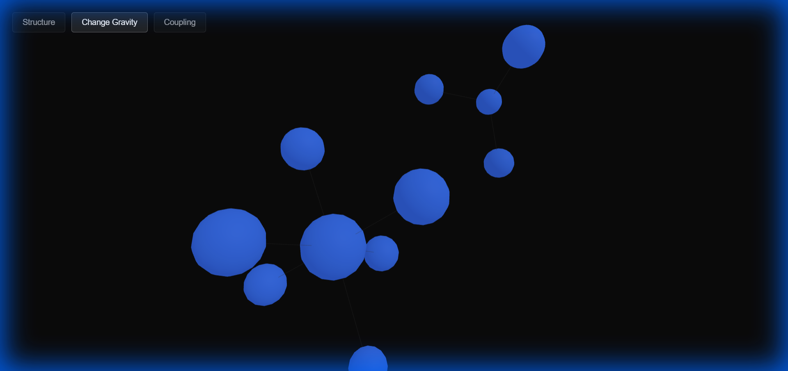
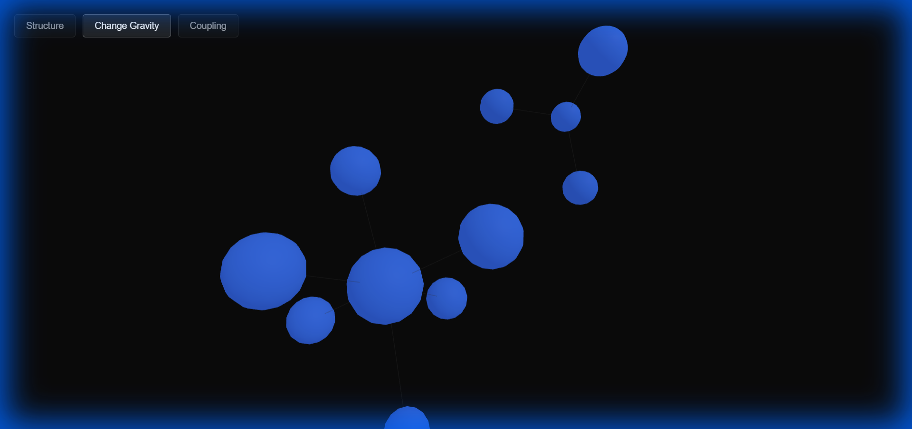
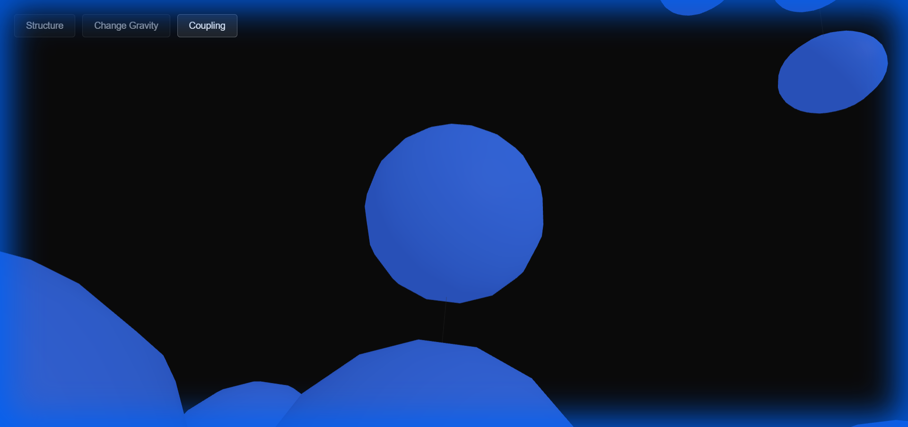

# ATLAS

**Live spatial codebase visualization. Architecture emerges in real-time.**

[](https://opensource.org/licenses/MIT)
[](https://nodejs.org/)

> No reports. No interpretation. Just truth.

---

## Overview

ATLAS transforms any codebase into a live, explorable 3D spatial map. Watch your architecture emerge as the graph assembles in real-time, revealing structural truths through force-directed physics.

**Key Features:**
- ⚡ **Instant Launch** - Browser opens in < 1 second
- 🔄 **Live Streaming** - Nodes appear incrementally, graph settles visibly
- 🎯 **Influence-Based Sizing** - Node size = centrality (PageRank), not raw metrics
- 🔀 **Three Visual Modes** - Reveal different architectural truths
- 🎨 **Visual Restraint** - No decoration, structure speaks for itself

---

## Quick Start

### Installation

```bash
npm install -g .
```

### Usage

```bash
atlas .
```

**That's it.** Browser opens automatically. Graph assembles. Architecture emerges.

---

## Visual Modes

ATLAS provides three force-reweighted views of your codebase. Toggle between them to reveal different structural truths.

### Structure Mode (Default)

Module boundaries and import relationships. Base layout reveals architecture immediately.



---

### Change Gravity Mode

Files that change together pull together. Co-change edges weighted 3x. Core churn areas compress.



---

### Coupling Mode

Tightly coupled clusters compress. Dependency edges weighted 3x. **Dramatic cluster splits reveal architectural boundaries.**



*Notice the dramatic split into backend/frontend clusters - this is alternate structural truth emerging.*

---

## How It Works

### 1. Incremental Analysis

ATLAS doesn't wait for complete analysis. It streams discoveries immediately:

- **File Scanner** - Discovers code files, streams to UI
- **Dependency Analyzer** - Parses imports via AST, creates edges
- **Git Analyzer** - Extracts churn and co-change patterns
- **Centrality Calculator** - Computes PageRank influence

### 2. Force-Directed Layout

Physics-based graph layout with mode-dependent force reweighting:

- **Repulsion** - Nodes push apart
- **Attraction** - Edges pull nodes together (weight varies by mode)
- **Center Gravity** - High-centrality nodes pulled to center
- **2.5D Positioning** - Shallow depth for clarity

### 3. Live Rendering

Three.js WebGL visualization with smooth interpolation:

- Nodes = spheres (size = influence)
- Edges = lines (opacity = strength)
- Hover = tooltip (path, centrality, churn)
- Click = focus camera

---

## Architecture

```
ATLAS/
├── backend/
│   ├── server.js              # WebSocket streaming orchestration
│   └── analysis/
│       ├── scanner.js         # Incremental file discovery
│       ├── dependency-analyzer.js  # AST-based import parsing
│       ├── git-analyzer.js    # Churn & co-change analysis
│       ├── centrality.js      # PageRank influence calculation
│       └── layout-engine.js   # Force-directed physics
├── frontend/
│   ├── index.html             # Minimal shell
│   ├── style.css              # Clean dark design
│   └── js/
│       ├── main.js            # WebSocket client & mode management
│       ├── scene.js           # Three.js 2.5D setup
│       ├── graph-renderer.js  # Node/edge rendering
│       └── interactions.js    # Hover & click handling
└── cli.js                     # Entry point
```

---

## Design Principles

### Truth Before Spectacle

ATLAS prioritizes correctness over visual flair:

✓ **Node size = influence** (centrality via PageRank, not file size)  
✓ **Strong base layout** (reveals architecture without mode switching)  
✓ **Mode reweighting** (adjusts forces, doesn't replace graph)  
✓ **Visual restraint** (no glassmorphism, no particles, no decoration)  
✓ **Incremental streaming** (alive in 2 seconds, no loading screens)

### Success Criteria

ATLAS succeeds if:

- Users say "holy shit" on first load
- They discover architectural truths without reading
- The map feels alive, not static
- Core modules are visibly central within 5 seconds

---

## Technical Details

### Supported Languages

- JavaScript / TypeScript (`.js`, `.jsx`, `.ts`, `.tsx`)
- Python (`.py`)
- Java (`.java`)
- C/C++ (`.c`, `.cpp`, `.h`)
- Go (`.go`)
- Rust (`.rs`)
- Ruby (`.rb`)
- PHP (`.php`)
- C# (`.cs`)
- Swift (`.swift`)
- Kotlin (`.kt`)

### Requirements

- Node.js 18+
- Modern browser with WebGL support
- Git repository (optional, for change analysis)

### Performance

- Small repos (< 50 files): Instant
- Medium repos (50-500 files): 2-5 seconds
- Large repos (500+ files): 5-15 seconds

Graph remains responsive during analysis.

---

## Interactions

- **Pan/Zoom** - Mouse drag / scroll wheel
- **Rotate** - Right-click drag
- **Hover** - Shows file path, centrality, churn
- **Click** - Focuses camera on node
- **Mode Toggle** - Buttons in top-left corner

---

## Philosophy

ATLAS is not a diagram tool. It's not a code explorer. It's not a metrics dashboard.

**ATLAS is a truth engine.**

It reveals what's actually there - the weight of influence, the gravity of change, the tension of coupling. No interpretation. No narrative. Just emergent structure.

If it looks impressive but misleading, it failed.

---

## License

MIT

---

**Spectacle backed by truth.**
